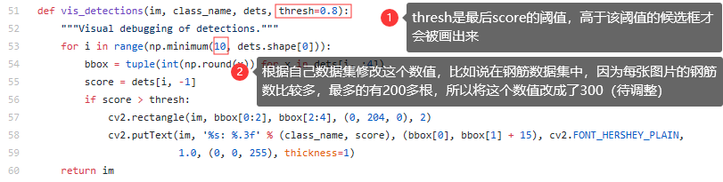
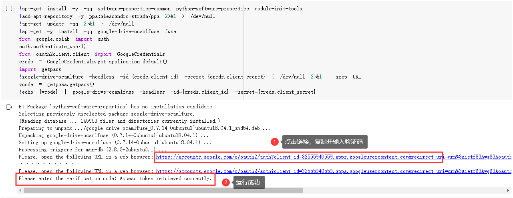
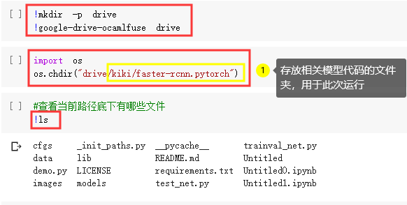
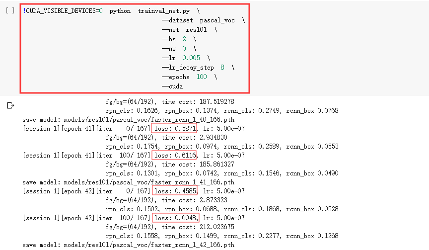
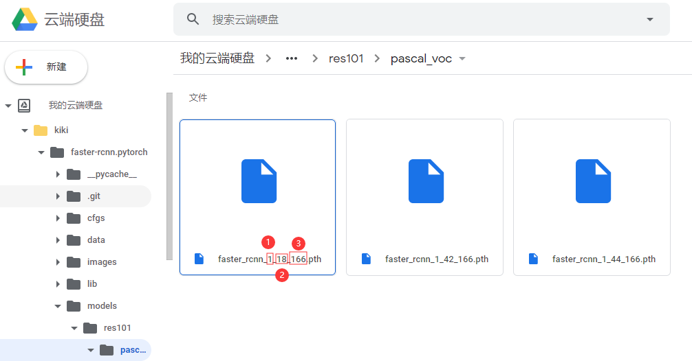
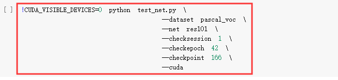
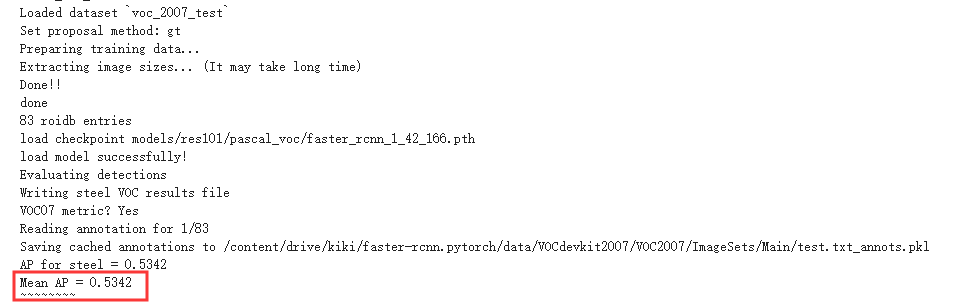

# Cola免费GPU跑Faster_RCNN训练自己的数据集

## 一、数据

对原始图片进行目标标注，可使用工具LabelImg。labelImg下载及使用方法参见： https://blog.csdn.net/python_pycharm/article/details/85338801#commentsedit

之后将数据整理成以下形式，其中Main文件夹中的4个txt文件是划分数据集为训练测试验证集，文件里主要存储图片名称，可由代码/faster-rcnn.pytorch/data/VOCdevkit2007/VOC2007/makeTxt.py运行而成（注意修改代码中路径）

```
MyData
│  
├─Annotations	#存放图片标注后的xml文件
│   ├── 0009496A.xml
│   ├── 000C7C0E.xml
│   └── ... ...
|  
├─ImageSets
│   └─Main	#将数据划分训练、测试、验证集、图片名称存放在txt中
│       ├── test.txt
│       ├── train.txt
│       ├── trainval.txt
│       └── valid.txt
│          
└─JPEGImages	#存放原始图片
    ├── 0009496A.jpg
    ├── 000C7C0E.jpg
    └── ... ...
```

红细胞、苹果橘子、钢筋标注后的数据下载参见

https://pan.baidu.com/s/1iFnjmvAsjJjxEg5BB5LQPg 提取码：5xzs

## 二、代码

faster_rcnn的代码参考https://github.com/jwyang/faster-rcnn.pytorch	（注：我跑的是pytorch0.4.0版的）

如果要训练测试自己的数据集，要进行以下操作

> 以下操作既可以在本地linux操作，也可以在Cola上操作，因为先前我在本地虚拟机上跑过此代码，但是因为gcc版本cuda版本等各种问题，放弃了，所以这些操作基本是在本地处理好的

- #### clone代码到本地

本地linux：`git clone https://github.com/jwyang/faster-rcnn.pytorch.git`

Cola：`!git clone https://github.com/jwyang/faster-rcnn.pytorch.git`

> 注：若是pytorch1.0版本 `!git clone -b pytorch-1.0 https://github.com/jwyang/faster-rcnn.pytorch.git`

- #### 上传数据和模型

在faster-rcnn.pytorch/下新建data文件夹，在data下新建pretrained_model文件夹，上传resnet101_caffe.pth；在data下新建VOCdevkit/VOC2007/，上传之前标注好的数据（即Annotations、ImageSets、JPEGImages三个文件夹）

```
data
│  
├─pretrained_model	
│   └── resnet101_caffe.pth	#作为特征提取网络，也可以下载上传vgg16_caffe.pth
|
└─VOCdevkit
    └─VOC2007
        ├── Annotations
        ├── ImageSets
        └── JPEGImages
```

resnet101_caffe.pth和vgg16_caffe.pth下载传送门：https://pan.baidu.com/s/1ErzOl2jEwBzzc9ZlcHJNqg 	提取码：xmiy

- #### 关于CUDA、cudnn及model的一些设置与编译

这里是在本地linux上运行的

```python
#注意运行此步骤，需在torch==0.4.0环境下
#进入到faster-rcnn.pytorch/lib文件夹下
cd faster-rcnn.pytorch/lib

#执行make.sh（好像是每更换一次数据集需要执行一次，具体不记得了）
sh make.sh
```

- #### 修改类别和最多输出框

根据自己数据集，将代码中的类别设置成自己要检测的类别

（1）/faster-rcnn.pytorch/lib/datasets/pascal_voc.py------中的self._classes

（2）/faster-rcnn.pytorch/demo.py------中的pascal_classes

> **注意：**如果你的类别含有大写字母，可能会出现KeyError的错误，所以建议类别全部使用小写字母

faster-rcnn对于每个图片会给出300个检测框，显示的时候，会限制最大显示框数量，宝宝们可以根据需要修改

（3）/faster-rcnn.pytorch/lib/model/utils/net_utils.py-------中的53行的vis_detections函数
thresh我改成了0.5，可根据情况自行修改



- #### 存放demo图片

运行demo.py前记得把要测试的图片放入faster-rcnn.pytorch/images文件夹中

## 三、Colaboratory运行

Colaboratory有免费的GPU可以用，前提是你有梯子，可以翻墙。
Cola的一些基础设置参考：https://www.jianshu.com/p/aee6360beab5

因为Google Drive的免费存储空间只有15G，所以朋友们，一般我们只能训练小批量数据，大批量的话，还是花钱吧！！！

> **友情提醒：**Google Drive内存购买不支持国内的银行卡支付，网上有朋友说可以在手机上下载Google云端硬盘App，然后利用苹果APP Store绑定银行卡就可以用国内的银行卡支付。我还没试验过，因为穷=。=！

节选出后面每次断开都得重新来一遍的一些重要步骤：

<font color=red size=4>Google Drive云盘中 新建-->更多-->Google Colaboratory，创建一个ipynb文件</font>，以下操作均在ipynb文件中操作

### 0、设置GPU

将“修改-->笔记本设置”中的硬件加速器修改为GPU，点击保存

### 1、安装相应的库，进行授权绑定



### 2、挂载google drive



### 3、一些包的卸载和安装

因为要跑的代码对一些包的版本有要求，而Cola安装包时一般会默认安装最新的包，所以要卸载一下原来版本，重新安装指定版本，这里我们要求

- torch--0.4.0

> 相关的torchvision以及fastai包都需要安装对应版本

- scipy--1.2.1

> 现有scipy为1.3.2，不更改为低版本的话，运行trainval_net.py会报 ImportError: cannot import name 'imread' 错

Cola中执行命令前面要加一个 " ! "，如卸载torch---`!pip uninstall torch`，安装scipy1.2.1版本---`!pip install scipy==1.2.1`

### 4、模型训练

根据自己数据情况调整参数，最后根据loss大小挑选最优模型进行测试和demo展示，这里epoch跑到45左右我就给停了，因为后面loss变化不大，需要调整别的参数来提升结果

> **参数解释**
>
> - CUDA_VISIBLE_DEVICES=0	#用0号GPU
> - --dataset pascal_voc	#用pascal数据集
> - --net res101	#用res101作为特征提取网络，可换为net vgg16
> - --bs 2	#batch size，数据量足够大时可适当减小bs,但盲目减少会导致无法收敛
> - --nw 0	#number work，线程读取，显存小的话可以设为1
> - --lr 0.005	#初始学习率
> - --lr_decay_step 8	#每8个epoch学习率衰减一次
> - --epochs 100	#每个epoch都过一遍全部的训练图
> - --cuda	#使用cuda



### 5、模型测试

根据模型训练中找loss最小或者训练保存的最后几个模型



其中①指代的是checksession，②指代的是checkepoch，③指代的是checkpoint，在object_det.py中输入





得到MAP为0.5342

### 6、demo展示

为了对模型有直观感受，对faster-rcnn.pytorch/images文件夹中的几张图片进行测试，运行demo.py


运行结束后，打开faster-rcnn.pytorch/images，找到.det的图片查看模型效果。

至此，免费GPU尝试圆满完成，YEAH！！！

## 附录：Cola执行代码汇总

将以上具体操作代码，整理如下

```python
#1、安装相应的库，进行授权绑定
!apt-get install -y -qq software-properties-common python-software-properties module-init-tools
!add-apt-repository -y ppa:alessandro-strada/ppa 2>&1 > /dev/null
!apt-get update -qq 2>&1 > /dev/null
!apt-get -y install -qq google-drive-ocamlfuse fuse
from google.colab import auth
auth.authenticate_user()
from oauth2client.client import GoogleCredentials
creds = GoogleCredentials.get_application_default()
import getpass
!google-drive-ocamlfuse -headless -id={creds.client_id} -secret={creds.client_secret} < /dev/null 2>&1 | grep URL
vcode = getpass.getpass()
!echo {vcode} | google-drive-ocamlfuse -headless -id={creds.client_id} -secret={creds.client_secret}


#2、挂载google drive
!mkdir -p drive
!google-drive-ocamlfuse drive

import os
##注意将kiki/faster-rcnn.pytorch修改成自己的文件夹
os.chdir("drive/kiki/faster-rcnn.pytorch")

#查看当前路径底下有哪些文件
!ls


#3、安装/卸载包
#查看当前安装包的版本
pip list

#因为我要跑的代码是pytorch==0.4.0的，所以删除原有版本
#注意torchvision和fastai版本和torch版本有依赖关系，所以要一起卸载
!pip uninstall torchvision
!pip uninstall fastai
!pip uninstall torch

#安装pytorch0.4和相对应的torchvision
!pip3 install http://download.pytorch.org/whl/cu80/torch-0.4.0-cp36-cp36m-linux_x86_64.whl
!pip install torchvision==0.2.1

#卸载原scipy，版本过高，会报错ImportError: cannot import name 'imread'
!pip uninstall scipy
#安装scipy1.2.1
!pip install scipy==1.2.1


#4、模型训练
#自己数据集的模型训练，根据自己数据情况调整参数
!CUDA_VISIBLE_DEVICES=0 python trainval_net.py \
                    --dataset pascal_voc \
                    --net res101 \
                    --bs 2 \
                    --nw 0 \
                    --lr 0.005 \
                    --lr_decay_step 8 \
                    --epochs 100 \
                    --cuda

#5、模型测试
#测试自己的数据集，根据自己数据情况调整参数
!CUDA_VISIBLE_DEVICES=0 python test_net.py \
                    --dataset pascal_voc \
                    --net res101 \
                    --checksession 1 \
                    --checkepoch 42 \
                    --checkpoint 166 \
                    --cuda
                    
#6、demo展示                   
#demo图片结果展示，根据自己数据情况调整参数
!CUDA_VISIBLE_DEVICES=0 python demo.py \
                    --dataset pascal_voc \
                    --net res101 \
                    --checksession 1 \
                    --checkepoch 42 \
                    --checkpoint 166 \
                    --cuda \
                    --load_dir models
```

## 参考资料

 https://blog.csdn.net/python_pycharm/article/details/85338801#commentsedit

https://github.com/jwyang/faster-rcnn.pytorch

https://blog.csdn.net/liuhongkai111/article/details/99124290

https://www.jianshu.com/p/aee6360beab5

https://blog.csdn.net/LCCFlccf/article/details/89302730
